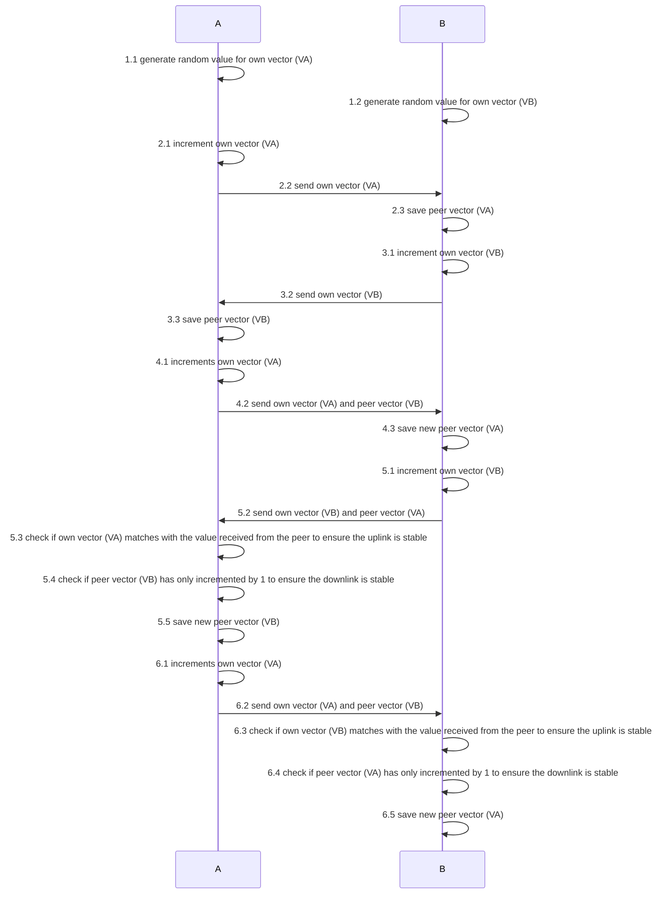

# Stateless Radio Uplink and Downlink Monitoring

I am working on a radio-controlled drone/robot project. For the radio communication, I am using [LoRa](https://de.wikipedia.org/wiki/Long_Range_Wide_Area_Network#LoRa_Allianz) in a [peer-to-peer configuration](https://de.wikipedia.org/wiki/Peer-to-Peer), which is a stateless radio communication technology.
The downside of stateless radio communication is that its communication is stateless.
Ergo, you can't make sure that a transmission has been received.
This would be if the drone goes out of range or the radio communication is disrupted otherwise.

To mitigate this problem, I have invented a novel lightweight algorithm heavily inspired by the vector [clock alrogithm](https://en.wikipedia.org/wiki/Vector_clock) and [heart beat algorithm](https://en.wikipedia.org/wiki/Heartbeat_(computing)).
It is a stateless fire-and-forget ping pong to exchange incrementing number pair where each node has its number.
If both nodes have the numbers sent with the heartbeat matching, the link can be considered stable,
if one of the numbers is off, you can derive whether the uplink or downlink is having problems.
Thus allowing lightweight monitoring of uplink and downlink radio communication to detect a lost link,
without a chatty callback to acknowledge every transmission.

The below sequence diagram shows the algorithm in detail.
Once steps 1 - 6 have been executed, the system only needs to loop steps 5 and 6 indefinitely. 

I develop this proof of concept with a pair of two [RangePi](https://shop.sb-components.co.uk/products/range-pi) USB dongles. They are based on [Raspberry Pi RP2040](https://de.wikipedia.org/wiki/RP2040) and LoRa Modules.
It takes about 15 seconds up to two minutes to complete.

Below you can see the modules working:

## Connection not Ensured on First Node

## First Exchange of "Vector Clock Values" via heartbeat broadcast on First Node

## State of Ensured Connection on First Node

## State of Ensured Connection on Second Node

