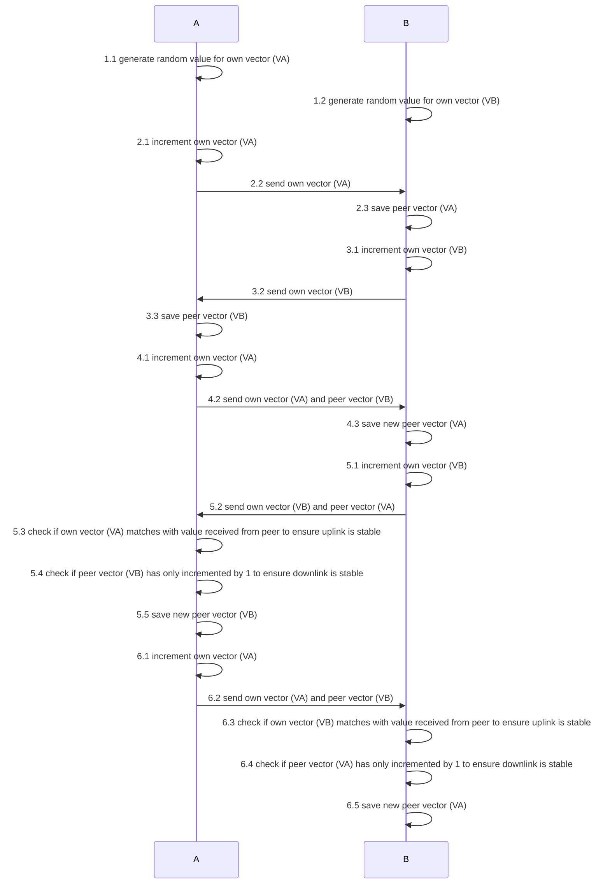

# Stateless Radio Uplink and Downlink Monitoring

I am working on a radio controlled drone/robot project. For the radio communication I am using [LoRa](https://de.wikipedia.org/wiki/Long_Range_Wide_Area_Network#LoRa_Allianz) in a [peer-to-peer configuration](https://de.wikipedia.org/wiki/Peer-to-Peer), which is a stateless radio communication technology.
The downside of stateless radio communcation is that its communication is stateless, ergo you cannot ensure that a transmission has been received accordingly.
In my case, this would be if the drone goes out of range or the radio communication is disrupted otherwise.

To mittigate this problem, I have invented an novel light weight algorithm heavily inspirerd by vector [clock alrogithm](https://en.wikipedia.org/wiki/Vector_clock) and [heart beat algorithm](https://en.wikipedia.org/wiki/Heartbeat_(computing)).
It basically is a stateless fire-and-forget ping pong to exchange incrementing number pair where each node has its own number.
If both node have the same numbers send with the heart beat the link is stable, if one of the number is off you can derive wheather uplink or downlink is having problems.
Thus allowing light weight monitoring of uplink and downlink the radio communication to detect a lost link, without chatty callback to acknowledge every transmission.

The below sequence diagram show the algorithm in detail.
Once steps 1 - 6 have been executed the system only needs to loop the steps 5 and 6 indefinitely. 

I develop this proof of concept with a pair of two [RangePi](https://shop.sb-components.co.uk/products/range-pi) USB dongles. They are based on [Raspberry Pi RP2040](https://de.wikipedia.org/wiki/RP2040) and LoRa Modules.
It takes about 15 seconds up to two minutes to complete.

Below you can see the modules working:

## Connection not Ensured on First Node

## First Exchange of "Vector Clock Values" via heart beat broad cast on First Node

## State of Ensured Connection on First Node

## State of Ensured Connection on Second Node

